# Ammalgam Protection System Workflow

A reactive smart contract system built on the REACTIVE Network that provides automated position protection for users in Ammalgam liquidity pairs. The system monitors user positions in real-time and automatically executes protection measures when actual Ammalgam liquidation conditions are detected.

## System Flow

```mermaid
sequenceDiagram
    participant User
    participant ReactiveContract as Reactive Contract<br/>(REACTIVE Network)
    participant CallbackContract as Callback Contract<br/>(Destination Chain)
    participant AmmalgamPair as Ammalgam Pair
    participant ValidationLib as Validation Library
    participant SaturationState as Saturation State  
    participant LiquidationLib as Liquidation Library
    participant ProtectionToken as Protection Token
    participant SystemContract as System Contract<br/>(Kopli)

    Note over User, SystemContract: Phase 1: System Setup
    
    User->>CallbackContract: Deploy AmmalgamProtectionCallback
    User->>ReactiveContract: Deploy AmmalgamProtectionReactive
    User->>ReactiveContract: addMonitoredPair(pairAddress)
    ReactiveContract->>SystemContract: Subscribe to all relevant events
    CallbackContract->>CallbackContract: setLibraryAddresses(validationLib, liquidationLib)

    Note over User, SystemContract: Phase 2: User Subscription (CORRECTED)
    
    User->>ProtectionToken: approve(callbackContract, maxAmount)
    User->>CallbackContract: subscribeToProtection(pair, type, solvencyBuffer, saturationThreshold, asset, maxAmount)
    CallbackContract->>AmmalgamPair: getInputParams(user) - Verify position exists
    AmmalgamPair-->>CallbackContract: Confirm borrowing position
    CallbackContract-->>User: emit UserSubscribed

    Note over User, SystemContract: Phase 3: CORRECTED Periodic Monitoring (Every 5 Minutes)
    
    SystemContract->>ReactiveContract: CRON Event
    ReactiveContract->>ReactiveContract: _handlePeriodicCheck()
    ReactiveContract->>CallbackContract: checkAndProtectPositions()
    
    loop For Each Subscribed User
        CallbackContract->>AmmalgamPair: getInputParams(user, true)
        AmmalgamPair-->>CallbackContract: Current position InputParams + hasBorrow
        
        CallbackContract->>CallbackContract: _analyzePositionWithAmmalgam()
        
        Note over CallbackContract, LiquidationLib: CORRECTED RISK ANALYSIS FLOW
        
        Note over CallbackContract: STEP 1: Check HARD Liquidation Risk
        CallbackContract->>ValidationLib: validateSolvency(inputParams)
        
        alt Validation Fails (Throws Exception)
            ValidationLib-->>CallbackContract: Position is liquidatable - HARD risk detected
            CallbackContract->>CallbackContract: riskType = HARD_LIQUIDATION + requiresImmediateAction = true
        
        else Validation Passes
            ValidationLib-->>CallbackContract: Position is solvent
            
            Note over CallbackContract: Check solvency buffer for early warning
            CallbackContract->>CallbackContract: Check if close to user's solvency buffer threshold
            
            alt Close to Solvency Buffer
                CallbackContract->>CallbackContract: riskType = HARD_LIQUIDATION (preventive)
            else
                Note over CallbackContract: STEP 2: Check SOFT Liquidation Risk
                CallbackContract->>AmmalgamPair: saturationAndGeometricTWAPState()
                AmmalgamPair-->>CallbackContract: saturationStateAddress
                
                CallbackContract->>SaturationState: calcSatChangeRatioBips(params, liqPrices, sender, user)
                SaturationState-->>CallbackContract: ratioNetXBips, ratioNetYBips
                
                alt Saturation Ratio > User Threshold
                    CallbackContract->>CallbackContract: riskType = SOFT_LIQUIDATION
                else
                    Note over CallbackContract: STEP 3: Check LEVERAGE Liquidation Risk
                    CallbackContract->>LiquidationLib: liquidateLeverageCalcDeltaAndPremium(params, true, true)
                    LiquidationLib-->>CallbackContract: leverageParams with closeAmounts
                    
                    alt Leverage Liquidation Possible (closeAmounts > 0)
                        CallbackContract->>CallbackContract: riskType = LEVERAGE_LIQUIDATION
                        
                        alt Bad Debt Scenario
                            CallbackContract->>CallbackContract: requiresImmediateAction = true
                        end
                    else
                        CallbackContract->>CallbackContract: riskType = SAFE
                    end
                end
            end
        end
        
        alt Risk Detected (riskType != SAFE)
            CallbackContract->>CallbackContract: _executeProtection()
            
            alt Protection Type: COLLATERAL_ONLY
                CallbackContract->>ProtectionToken: transferFrom(user, contract, amount)
                CallbackContract->>ProtectionToken: transfer(pair, amount)
                CallbackContract->>AmmalgamPair: deposit(user)
                
            else Protection Type: DEBT_REPAYMENT_ONLY
                CallbackContract->>ProtectionToken: transferFrom(user, contract, amount)
                CallbackContract->>ProtectionToken: transfer(pair, amount)
                
                alt LEVERAGE Risk + Has Liquidity Debt
                    CallbackContract->>AmmalgamPair: repayLiquidity(user)
                else Standard Risk
                    CallbackContract->>AmmalgamPair: repay(user)
                end
            end
            
            Note over CallbackContract, SaturationState: CRITICAL: Update Saturation After Protection
            CallbackContract->>AmmalgamPair: getInputParams(user, false) - Get updated position
            AmmalgamPair-->>CallbackContract: Updated InputParams
            CallbackContract->>AmmalgamPair: saturationAndGeometricTWAPState()
            AmmalgamPair-->>CallbackContract: saturationStateAddress
            CallbackContract->>SaturationState: update(updatedParams, user) - Update saturation tree
            
            CallbackContract-->>ReactiveContract: emit ProtectionExecuted
            
        else Risk Type is SAFE
            Note over CallbackContract: Skip - position safe according to Ammalgam logic
        end
    end
    
    CallbackContract-->>ReactiveContract: emit ProtectionCycleCompleted
    ReactiveContract->>ReactiveContract: processingActive = false

    Note over User, SystemContract: Phase 4: CORRECTED Emergency Response (Liquidation Event)

    AmmalgamPair-->>ReactiveContract: Liquidation Event (borrower, to, amounts..., liquidationType)
    ReactiveContract->>ReactiveContract: _handleLiquidationEvent()
    ReactiveContract->>ReactiveContract: Extract borrower + liquidationType from event
    
    Note over ReactiveContract: Analyze liquidation type for appropriate response
    alt liquidationType == HARD (0)
        Note over ReactiveContract: Hard liquidation - position might still exist with remaining debt
        ReactiveContract->>ReactiveContract: reason = "LTV exceeded, checking remaining position"
    else liquidationType == SOFT (1) 
        Note over ReactiveContract: Soft liquidation - only collateral taken, debt remains
        ReactiveContract->>ReactiveContract: reason = "Saturation based, position may still exist"
    else liquidationType == LEVERAGE (2)
        Note over ReactiveContract: Leverage liquidation - partial closure possible
        ReactiveContract->>ReactiveContract: reason = "Partial closure, checking remaining risk"
    end
    
    ReactiveContract-->>ReactiveContract: emit EmergencyResponseTriggered(pair, borrower, type, reason)
    ReactiveContract->>CallbackContract: emergencyProtectionCheck(borrower, pair)
    
    CallbackContract->>CallbackContract: Check if borrower is subscribed to our protection
    
    alt Borrower IS Subscribed
        CallbackContract->>AmmalgamPair: getInputParams(borrower, true)
        
                    alt Position Still Exists (hasBorrow = true)
            Note over CallbackContract: Position partially liquidated - analyze remaining risk
            CallbackContract->>CallbackContract: _analyzePositionWithAmmalgam() - Full risk analysis
            
            alt Remaining Position Still At Risk
                CallbackContract->>CallbackContract: Execute emergency protection (1-min cooldown)
                CallbackContract-->>ReactiveContract: emit ProtectionExecuted
            else Remaining Position Now Safe
                Note over CallbackContract: Liquidation resolved the risk - no additional protection needed
            end
            
        else Position Completely Liquidated (hasBorrow = false)
            Note over CallbackContract: Nothing left to protect - position fully liquidated
            CallbackContract->>CallbackContract: Skip protection
        end
        
    else Borrower NOT Subscribed
        Note over CallbackContract: Skip - user not protected by our system
    end
    
    CallbackContract-->>ReactiveContract: emit ProtectionCycleCompleted

    Note over User, SystemContract: Phase 5: CORRECTED Position Change Response (Real-time)

    Note over User, SystemContract: HIGH PRIORITY - Risk Increasing Events
    User->>AmmalgamPair: borrow() / borrowLiquidity() / withdraw() [Risk Increasing]
    AmmalgamPair-->>ReactiveContract: Borrow/Withdraw Event
    ReactiveContract->>ReactiveContract: _handleHighPriorityEvent() - 60 second cooldown
    ReactiveContract->>ReactiveContract: Extract user from event + track activity
    ReactiveContract->>CallbackContract: positionChangeProtectionCheck(user, pair)
    
    CallbackContract->>CallbackContract: Check if user is subscribed to protection
    
    alt User IS Subscribed
        CallbackContract->>CallbackContract: _checkAndProtectUser(user, emergency=false)
        CallbackContract->>CallbackContract: Same corrected risk analysis flow as above
        
        alt Position Now At Risk (Based on Ammalgam Logic)
            CallbackContract->>CallbackContract: Execute appropriate protection
            CallbackContract-->>ReactiveContract: emit ProtectionExecuted
        else Position Still Safe
            Note over CallbackContract: No protection needed - position remains healthy
        end
        
    else User NOT Subscribed
        Note over CallbackContract: Skip - user not using protection service
    end

    Note over User, SystemContract: LOWER PRIORITY - Risk Decreasing Events
    User->>AmmalgamPair: repay() / repayLiquidity() / deposit() [Risk Decreasing]
    AmmalgamPair-->>ReactiveContract: Repay/Deposit Event (Lower Priority)
    ReactiveContract->>ReactiveContract: _handleLowPriorityEvent() - 120 second cooldown
    ReactiveContract->>CallbackContract: positionChangeProtectionCheck(user, pair)
    
    Note over CallbackContract: Same subscription check and risk analysis logic<br/>but with lower priority and longer cooldowns

    Note over User, SystemContract: Phase 6: User Management & Analytics

    User->>CallbackContract: getUserProtection(user, pair)
    CallbackContract-->>User: Return protection configuration and status
    
    User->>ReactiveContract: getSystemStatus()
    ReactiveContract-->>User: Return processing state, monitored pairs, timestamps, analytics
    
    User->>ReactiveContract: getPairLiquidationCount(pair)
    ReactiveContract-->>User: Return liquidation event count for analytics
    
    User->>CallbackContract: unsubscribeFromProtection(pair)
    CallbackContract->>CallbackContract: Remove protection & cleanup user data
    CallbackContract-->>User: emit UserUnsubscribed
```

##
